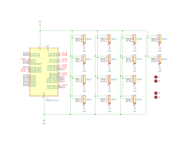
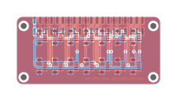
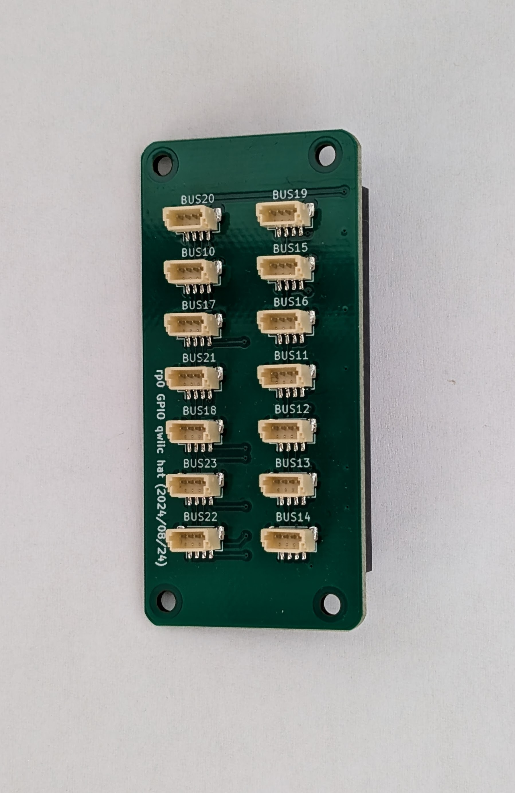
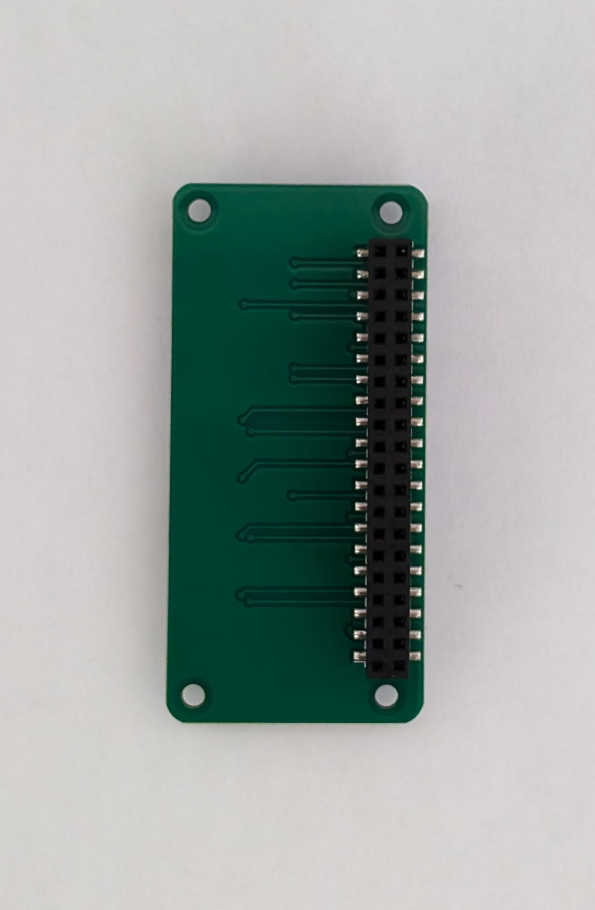
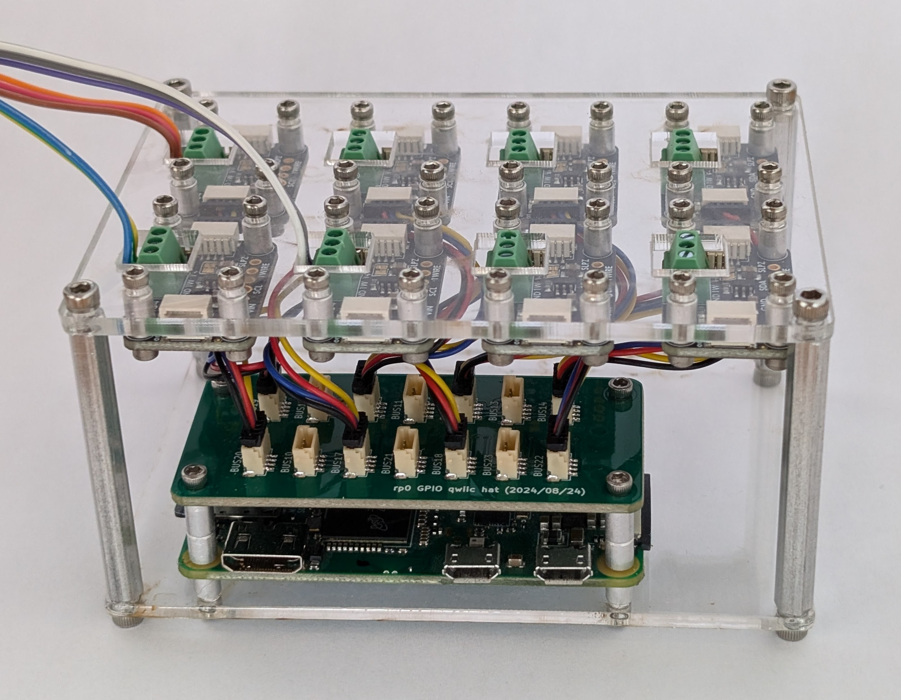

# Raspberry Pi qwiic hat

Raspberry pi GPIO pins can can be configured as i2c as described [here](1). There are 28 GPIO pins which can be configured as 14 i2c buses in total. This hat wires these 14 i2c busses including the [5 V rail](3) and the ground to 14 [qwiic](2) connectors. Add the following to the `[all]` section of the `/boot/firmware/config.txt` file to enable the i2c busses. The i2c devices will be available at `dev/i2c-n` (where n will be the bus number used in the dtoverlay)

    dtoverlay=i2c-gpio,i2c_gpio_sda=27,i2c_gpio_scl=18,bus=10
    dtoverlay=i2c-gpio,i2c_gpio_sda=25,i2c_gpio_scl=9,bus=11
    dtoverlay=i2c-gpio,i2c_gpio_sda=5,i2c_gpio_scl=11,bus=12
    dtoverlay=i2c-gpio,i2c_gpio_sda=12,i2c_gpio_scl=6,bus=13
    dtoverlay=i2c-gpio,i2c_gpio_sda=19,i2c_gpio_scl=26,bus=14
    dtoverlay=i2c-gpio,i2c_gpio_sda=15,i2c_gpio_scl=17,bus=15
    dtoverlay=i2c-gpio,i2c_gpio_sda=23,i2c_gpio_scl=22,bus=16
    dtoverlay=i2c-gpio,i2c_gpio_sda=10,i2c_gpio_scl=24,bus=17
    dtoverlay=i2c-gpio,i2c_gpio_sda=1,i2c_gpio_scl=0,bus=18
    dtoverlay=i2c-gpio,i2c_gpio_sda=2,i2c_gpio_scl=3,bus=19
    dtoverlay=i2c-gpio,i2c_gpio_sda=4,i2c_gpio_scl=14,bus=20
    dtoverlay=i2c-gpio,i2c_gpio_sda=7,i2c_gpio_scl=8,bus=21
    dtoverlay=i2c-gpio,i2c_gpio_sda=20,i2c_gpio_scl=21,bus=22
    dtoverlay=i2c-gpio,i2c_gpio_sda=16,i2c_gpio_scl=13,bus=23

## Schematic

  

## PCB

  

## Photos

  
  
  

[1]: https://forums.raspberrypi.com/viewtopic.php?t=205576
[2]: https://www.sparkfun.com/qwiic
[3]: https://pinout.xyz/pinout/5v_power 